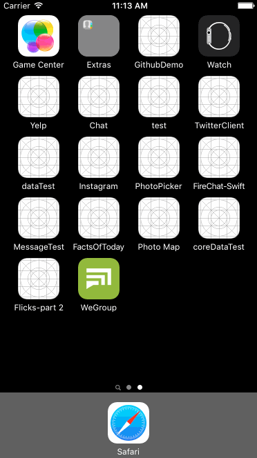

# *WeGroup*

**WeGroup** is a messaging app for both personal and group chats.

Time spent: **4 weeks** spent in total

## User Stories

- [x] As a user, I would like to register an account for WeGroup
- [x] As a user, I would like to log in WeGroup with username and password
- [x] As a user, I would like to create my own profile (region, bio)
- [x] As a user, I would like to update and change my profile picture
- [x] As a user, I would like to add contacts by typing their usernames
- [x] As a user, I would like to delete contacts
- [x] As a user, I would like to create new direct conversations
- [x] As a user, I would like to send messages in a direct conversation
- [x] As a user, I would like to receive messages sent from users in my contact list
- [x] As a user, I would like to create group conversations
- [x] As a user, I would like to send messages in a group conversation
- [x] As a user, I would like to receive message from the group conversations I am in
- [x] As a user, I would like people in the groups I’m involved in to be added to my contacts automatically
- [ ] As a user, I would like to see the conversations with unread messages to be marked
- [x] As a user, I would like to delete conversations
- [x] As a user, I would like to search a friend in contacts
- [x] As a user, I would like to search for groups that a friend is in

## Video Walkthrough 

Here's a walkthrough of implemented user stories:

GIF created with [LiceCap](http://www.cockos.com/licecap/).

## Notes

## License

Copyright [2016] [Qinxin Shi]

Licensed under the Apache License, Version 2.0 (the "License");
you may not use this file except in compliance with the License.
You may obtain a copy of the License at

http://www.apache.org/licenses/LICENSE-2.0

Unless required by applicable law or agreed to in writing, software
distributed under the License is distributed on an "AS IS" BASIS,
WITHOUT WARRANTIES OR CONDITIONS OF ANY KIND, either express or implied.
See the License for the specific language governing permissions and
limitations under the License.
